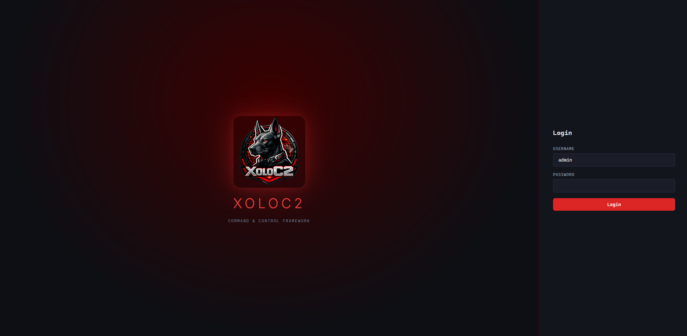
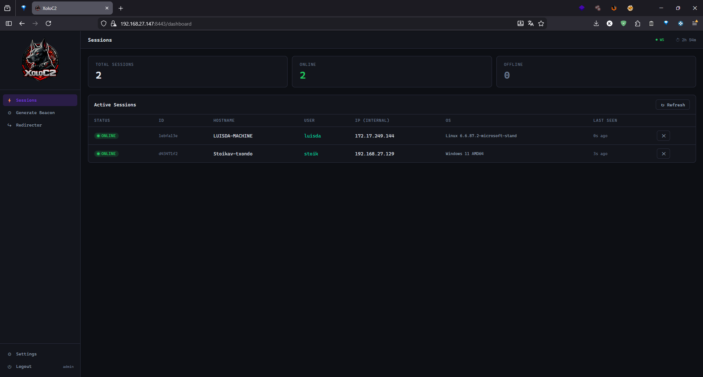
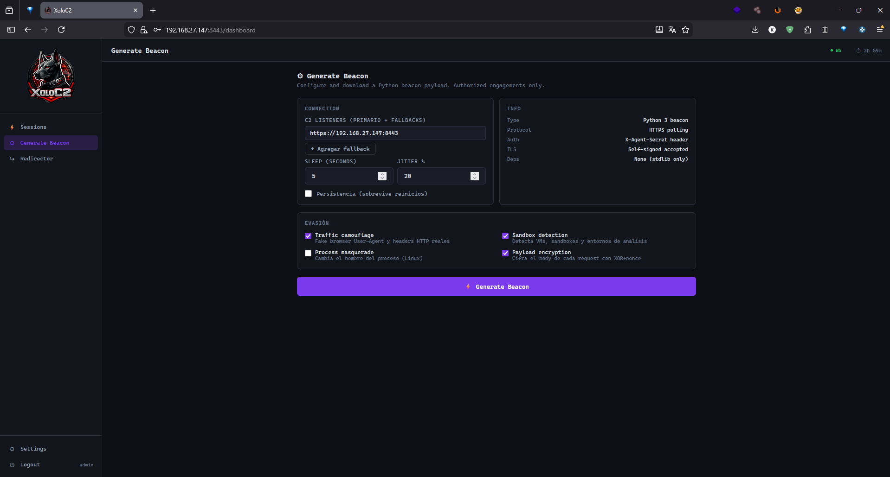
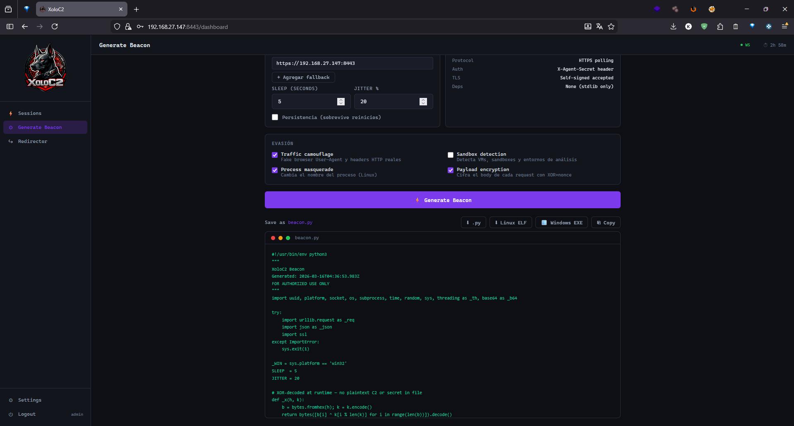
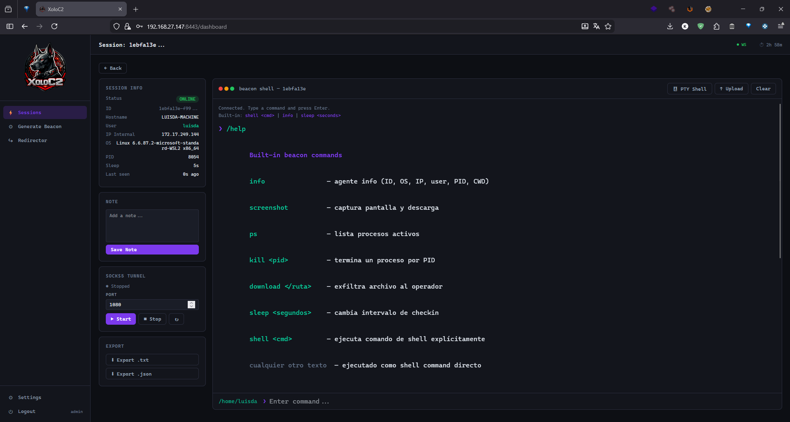
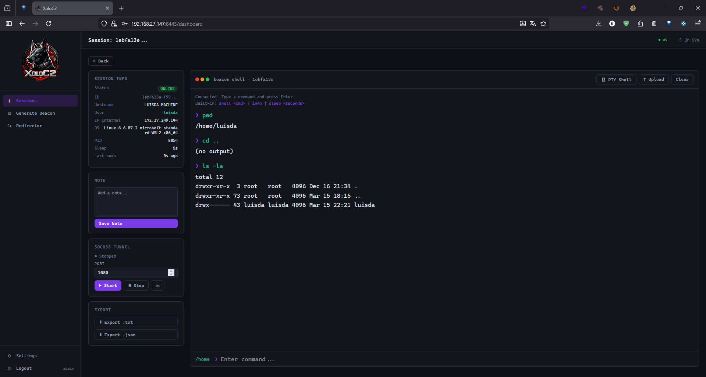
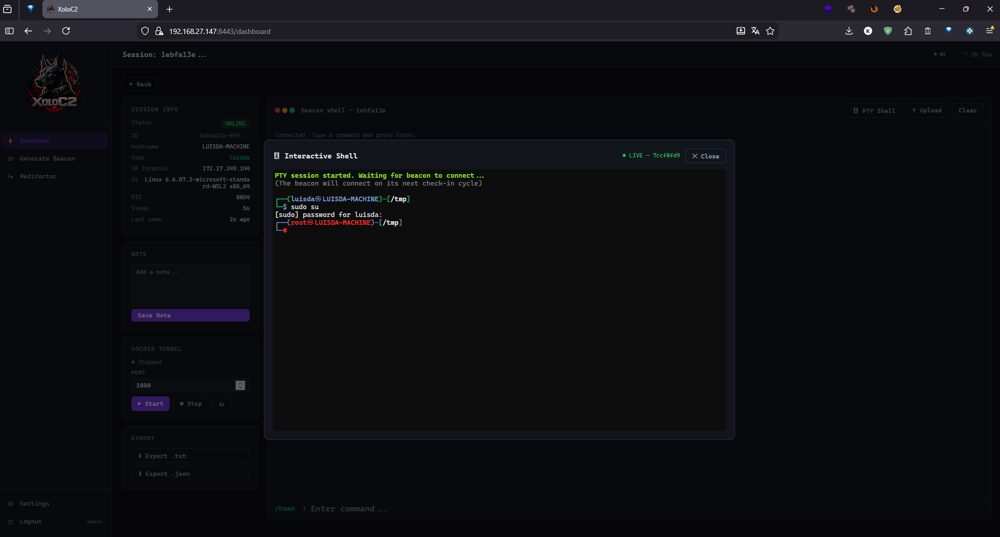
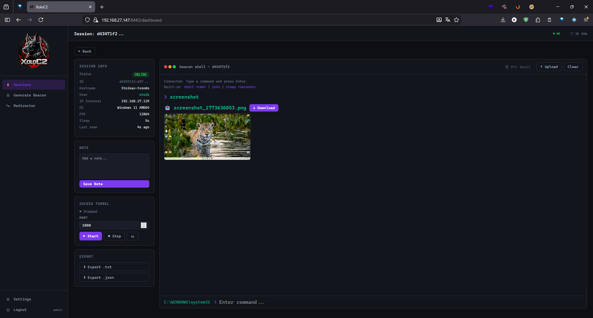
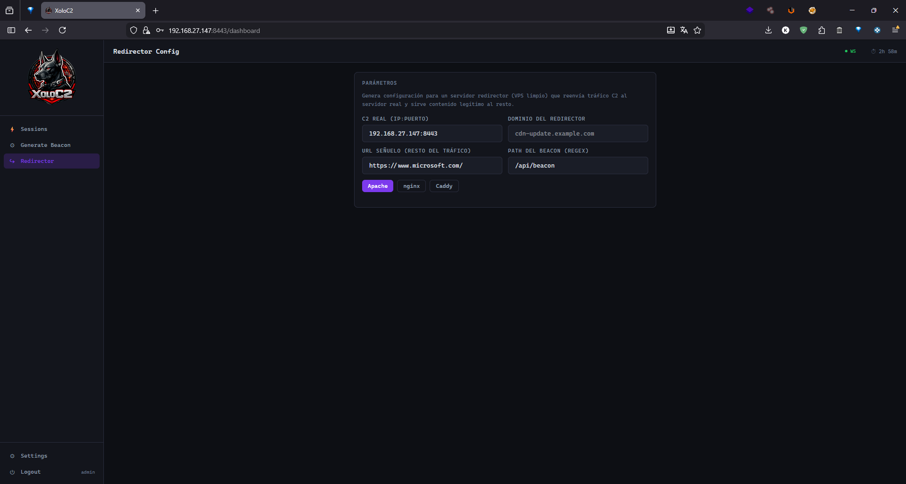
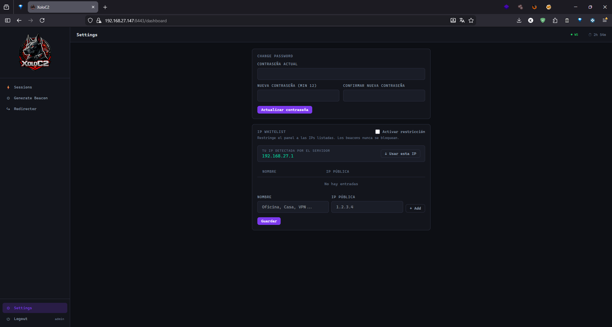

# XoloC2

[](https://python.org)
[](https://fastapi.tiangolo.com)
[](LICENSE)

**[ [English](#english) | [Español](#español) ]**

---

## Screenshots

<table>
  <tr>
    <td align="center"><b>Login</b></td>
    <td align="center"><b>Sessions</b></td>
  </tr>
  <tr>
    <td></td>
    <td></td>
  </tr>
  <tr>
    <td align="center"><b>Generate Beacon</b></td>
    <td align="center"><b>Beacon Code Output</b></td>
  </tr>
  <tr>
    <td></td>
    <td></td>
  </tr>
  <tr>
    <td align="center"><b>Session Shell + SOCKS5 Tunnel</b></td>
    <td align="center"><b>Command Execution</b></td>
  </tr>
  <tr>
    <td></td>
    <td></td>
  </tr>
  <tr>
    <td align="center"><b>PTY Interactive Shell (sudo su → root)</b></td>
    <td align="center"><b>Screenshot Exfil (Windows agent)</b></td>
  </tr>
  <tr>
    <td></td>
    <td></td>
  </tr>
  <tr>
    <td align="center"><b>Redirector Config Generator</b></td>
    <td align="center"><b>Settings</b></td>
  </tr>
  <tr>
    <td></td>
    <td></td>
  </tr>
</table>

---

<a name="english"></a>
# 🇬🇧 English

> **For authorized use only.** Only deploy against systems you have explicit written permission to test.

## What is XoloC2?

XoloC2 is a web-based Command & Control framework built for authorized penetration testing engagements. It provides a clean dark-themed dashboard, a Python and Java beacon that run with no external dependencies, and a full set of post-exploitation capabilities.

---

## Features

### Operator Panel
- **Real-time dashboard** powered by WebSockets — instant agent check-in and task completion notifications
- **Session management** — all active/inactive beacons with live online/offline status, external IP, and geolocation
- **Geographic map** — world map (Leaflet + CartoDB) showing agent locations resolved automatically from their external IP at check-in
- **Interactive terminal** — command-by-command shell with history (↑↓) and CWD tracking on both Windows and Linux
- **PTY shell** — full interactive pseudo-terminal via xterm.js (Linux beacons only)
- **File browser** — navigate the target filesystem with back/forward history; click to download files
- **File upload** — stage files on the server, beacon pulls and writes them to the target path
- **File download / exfil** — download any file from the target directly to the operator browser (binary-safe, 500 MB limit)
- **Screenshot** — capture and preview the target screen inline in the terminal
- **Process list** — cross-platform `ps` output
- **Kill process** — send SIGTERM / taskkill by PID
- **Session notes** — per-agent persistent text notes
- **Session tags** — label agents with custom tags for organization
- **Export tasks** — clean command/output history as `.txt` or `.json` (internal protocol commands filtered out automatically)
- **Redirector config generator** — generates ready-to-use Apache / nginx / Caddy configs for C2 traffic redirection
- **Bilingual UI** — full English / Spanish interface, togglable at runtime

### Beacon Generator
- **Python 3 stdlib only** — no pip install required on the target
- **Java beacon** — cross-platform `.jar`, compiles from the panel with `javac`
- **Unique XOR obfuscation key per generation** — C2 URLs and agent secret are XOR-encoded with a fresh random key each time; two beacons from the same server have different static content
- **Per-request XOR + nonce payload encryption** — each request body is encrypted with a random nonce; server decrypts transparently
- **HTTPS polling** — configurable sleep interval (1–300 s) and jitter percentage (0–80%)
- **Multi-listener failover** — primary C2 URL + any number of fallback URLs
- **Kill date** — optional expiry date; beacon calls `sys.exit(0)` / `System.exit(0)` after the configured date
- **Persistence** — Windows Registry (`HKCU\Software\Microsoft\Windows\CurrentVersion\Run`) / Linux crontab (`@reboot`)
- **Traffic camouflage** — randomized real-browser User-Agents and Referer headers
- **Sandbox detection** — detects VMs, low CPU/RAM, sandbox usernames/hostnames, analysis tools, timing attacks
- **Process masquerade** — renames process to `[kworker/0:1]` on Linux via `prctl`
- **Background execution** — Windows no-console process / Linux double-fork daemon
- **Linux ELF compile** — one-click PyInstaller build from the panel
- **Windows EXE compile** — cross-compilation via Wine (requires Wine on the server)

### Pivoting
- **SOCKS5 tunnel** — HTTP-tunnelled SOCKS5 proxy multiplexed over beacon polling
  - No extra tools required on the target
  - Start listener on any local port (default `1080`)
  - Compatible with `proxychains`, Burp Suite, Firefox, or any SOCKS5-aware tool
  - Supports multiple concurrent TCP channels

### Security & Operations
- **JWT authentication** — configurable session expiry, forced password change on first login
- **TOTP / MFA** — TOTP-based two-factor authentication (Google Authenticator / any TOTP app); QR code provisioning from the panel
- **Multi-operator** — create and delete additional operator accounts from Settings
- **bcrypt** password hashing (min 12 characters enforced)
- **IP whitelist** — restrict panel access to specific IPs; beacon endpoints always bypass
- **Rate limiting** — 10 failed login attempts in 5 minutes triggers a 15-minute lockout
- **Audit log** — timestamped log of all security events (LOGIN, LOGIN_FAIL, TASK_SENT, FILE_UPLOAD, AGENT_DELETED, USER_CREATED, USER_DELETED, PASSWORD_CHANGED); filterable, clearable
- **Webhook notifications** — send Discord / Slack / any webhook alerts for configurable events (new agent, login, failed login, agent deleted, task sent)
- **Security headers** — CSP, X-Frame-Options, X-Content-Type-Options, Referrer-Policy, Permissions-Policy
- **Timezone selector** — display all dates/logs in the operator's local timezone (Americas, US, LATAM, Europe, UTC)

---

## Quick Start

### Requirements
- Python 3.10+
- `openssl`

### Install

```bash
git clone https://github.com/Juguitos/XoloC2.git
cd XoloC2
bash install.sh
```

The installer will:
1. Prompt for the HTTPS port (default `8443`)
2. Create a Python virtual environment and install dependencies
3. Generate a self-signed TLS certificate
4. Bootstrap the database with a random `admin` password
5. Write a `start.sh` launch script

```
  URL:       https://0.0.0.0:8443
  Username:  admin
  Password:  <random — shown once, must be changed on first login>
```

### Start

```bash
./start.sh
```

### Run as a systemd service (recommended for production)

```bash
cat > /etc/systemd/system/xoloc2.service << 'EOF'
[Unit]
Description=XoloC2 C2 Server
After=network.target
Wants=network-online.target

[Service]
Type=simple
User=root
WorkingDirectory=/opt/XoloC2
Environment=XOLO_TRUST_PROXY=0
ExecStart=/opt/XoloC2/.venv/bin/python3 -m uvicorn server.main:app \
    --host 0.0.0.0 \
    --port 8444 \
    --ssl-keyfile server/certs/key.pem \
    --ssl-certfile server/certs/cert.pem \
    --log-level warning
Restart=on-failure
RestartSec=5
StandardOutput=journal
StandardError=journal
SyslogIdentifier=xoloc2

[Install]
WantedBy=multi-user.target
EOF

systemctl daemon-reload
systemctl enable xoloc2   # start on boot
systemctl start xoloc2
systemctl status xoloc2
```

View logs:

```bash
journalctl -u xoloc2 -f
```

### Non-interactive install

```bash
bash install.sh --port 443
bash install.sh --port 8443 --host 127.0.0.1
```

---

## Usage

### 1. Generate a Beacon

Go to **Generate Beacon** in the sidebar:
- Set your C2 listener URL(s) (primary + fallbacks)
- Configure sleep interval, jitter %, and optional kill date
- Choose evasion options (traffic camouflage, sandbox detection, process masquerade, payload encryption, background execution)
- Enable persistence if needed
- Download `.py` / `.java`, or compile to Linux ELF / Windows EXE / `.jar` directly from the panel

### 2. Deploy on Target

```bash
# Python
python3 beacon.py

# Compiled Linux binary
./beacon

# Java
java -jar beacon.jar
```

### 3. Interact

- Click a session in **Sessions**
- Use the terminal to run commands
- Click **🖥 PTY Shell** for a full interactive shell (Linux only)
- Use **↑ Upload** to push files to the target
- Use the **File Browser** to navigate and download files

### 4. SOCKS5 Pivot

In the session sidebar → **SOCKS5 Tunnel**:
1. Set a local port (e.g. `1080`) → click **▶ Start**
2. Configure `proxychains` to use `socks5 127.0.0.1 1080`
3. Browse the internal network through the beacon

```bash
proxychains nmap -sT -Pn 192.168.1.0/24
```

---

## Architecture

```
XoloC2/
├── install.sh                  # Installer (interactive or --port / --host flags)
├── server/
│   ├── main.py                 # FastAPI app, WebSocket, security headers, IP whitelist middleware
│   ├── database.py             # SQLAlchemy models (User, Agent, Task, AuditLog) + auto-migration
│   ├── auth.py                 # JWT + bcrypt + TOTP
│   ├── config.py               # Agent secret, JWT expiry, trust-proxy flag
│   ├── websocket_manager.py    # WebSocket broadcast manager
│   ├── socks5_server.py        # HTTP-tunnelled SOCKS5 proxy engine
│   ├── routers/
│   │   ├── auth_router.py      # Login (MFA), change password, rate limiting
│   │   ├── agents_router.py    # Agent CRUD, task queue, file upload/exfil, tags, notes
│   │   ├── beacon_router.py    # Beacon checkin (geo lookup), result submit, file fetch, XOR decrypt
│   │   ├── pty_router.py       # PTY session management + WebSocket streaming
│   │   ├── tunnel_router.py    # SOCKS5 tunnel beacon endpoints
│   │   ├── info_router.py      # Agent secret, Python/Java beacon compile
│   │   ├── settings_router.py  # Password, IP whitelist, MFA setup/disable, user management
│   │   ├── audit_router.py     # Audit log (read, filter, clear)
│   │   └── webhook_router.py   # Webhook config + async dispatch
│   └── templates/
│       └── dashboard.html      # Single-page app (vanilla JS, no framework, EN/ES i18n)
└── docs/
    └── vps-deployment.md       # VPS + domain deployment guide
```

---

## Beacon Commands

| Command | Description |
|---|---|
| `info` | Agent details (ID, OS, IP, user, PID, CWD) |
| `screenshot` | Capture and exfil screen |
| `ps` | List running processes |
| `kill <pid>` | Terminate process by PID |
| `download <path>` | Exfil file to operator browser |
| `sleep <seconds>` | Change check-in interval |
| `shell <cmd>` | Run shell command explicitly |
| `<any text>` | Executed as shell command directly |

---

## Deployment on VPS

See [`docs/vps-deployment.md`](docs/vps-deployment.md) for a full guide on deploying with a domain, nginx reverse proxy, and a valid Let's Encrypt certificate.

---

## Disclaimer

XoloC2 is developed for **authorized penetration testing and security research only**.
Unauthorized use against systems without explicit written permission is illegal.
The authors assume no liability for misuse.

---
---

<a name="español"></a>
# 🇲🇽 Español

> **Solo para uso autorizado.** Únicamente despliega contra sistemas para los que tengas permiso escrito explícito.

## ¿Qué es XoloC2?

XoloC2 es un framework de Command & Control basado en web, construido para pruebas de penetración autorizadas. Ofrece un dashboard con tema oscuro, un beacon Python y Java que corren sin dependencias externas y un conjunto completo de capacidades post-explotación.

---

## Funcionalidades

### Panel del Operador
- **Dashboard en tiempo real** vía WebSockets — notificaciones instantáneas de check-in y resultados de tareas
- **Gestión de sesiones** — todos los beacons activos/inactivos con estado online/offline, IP externa y geolocalización
- **Mapa geográfico** — mapa mundial (Leaflet + CartoDB) que muestra la ubicación de los agentes resuelta automáticamente desde su IP externa en el check-in
- **Terminal interactiva** — shell comando a comando con historial (↑↓) y seguimiento del directorio actual en Windows y Linux
- **PTY shell** — pseudo-terminal interactiva completa vía xterm.js (solo beacons Linux)
- **Explorador de archivos** — navega el sistema de archivos del target con historial atrás/adelante; clic para descargar archivos
- **Subida de archivos** — sube archivos al servidor, el beacon los descarga y escribe en el path destino
- **Descarga / exfiltración** — descarga cualquier archivo del target directamente al navegador (compatible con binarios, límite 500 MB)
- **Captura de pantalla** — captura y previsualiza la pantalla del target en la terminal
- **Lista de procesos** — salida `ps` multiplataforma
- **Terminar proceso** — envía SIGTERM / taskkill por PID
- **Notas de sesión** — notas de texto persistentes por agente
- **Tags de sesión** — etiqueta los agentes con tags personalizados para organizarlos
- **Exportar tareas** — historial limpio de comandos/salidas en `.txt` o `.json` (comandos internos de protocolo filtrados automáticamente)
- **Generador de config redirector** — genera configuraciones listas para Apache / nginx / Caddy para redirección de tráfico C2
- **UI bilingüe** — interfaz completa en inglés / español, cambiable en tiempo de ejecución

### Generador de Beacon
- **Solo stdlib de Python 3** — sin pip install requerido en el target
- **Beacon Java** — `.jar` multiplataforma, compila desde el panel con `javac`
- **Clave XOR de ofuscación única por generación** — las URLs del C2 y el secreto del agente se cifran XOR con una clave aleatoria nueva cada vez; dos beacons del mismo servidor tienen contenido estático diferente
- **Cifrado XOR + nonce por petición** — cada cuerpo de petición se cifra con un nonce aleatorio; el servidor descifra de forma transparente
- **Polling HTTPS** — intervalo de sleep (1–300 s) y jitter (0–80%) configurables
- **Failover multi-listener** — URL C2 primaria + número ilimitado de fallbacks
- **Kill date** — fecha de expiración opcional; el beacon ejecuta `sys.exit(0)` / `System.exit(0)` al llegar la fecha
- **Persistencia** — Registro de Windows (`HKCU\Software\Microsoft\Windows\CurrentVersion\Run`) / crontab Linux (`@reboot`)
- **Camuflaje de tráfico** — User-Agents y headers Referer reales de navegador, aleatorios
- **Detección de sandbox** — detecta VMs, CPU/RAM bajos, usernames/hostnames sospechosos, herramientas de análisis, ataques de timing
- **Mascarada de proceso** — renombra el proceso a `[kworker/0:1]` en Linux vía `prctl`
- **Ejecución en segundo plano** — proceso sin consola en Windows / daemon double-fork en Linux
- **Compilar a ELF Linux** — build PyInstaller con un clic desde el panel
- **Compilar a EXE Windows** — compilación cruzada vía Wine (requiere Wine en el servidor)

### Pivoting
- **Túnel SOCKS5** — proxy SOCKS5 tunelizado sobre HTTP, multiplexado sobre el polling del beacon
  - Sin herramientas adicionales requeridas en el target
  - Escucha en cualquier puerto local (por defecto `1080`)
  - Compatible con `proxychains`, Burp Suite, Firefox o cualquier herramienta SOCKS5
  - Múltiples canales TCP concurrentes

### Seguridad y Operaciones
- **Autenticación JWT** — expiración de sesión configurable, cambio de contraseña obligatorio en el primer login
- **TOTP / MFA** — autenticación de dos factores con TOTP (Google Authenticator / cualquier app TOTP); aprovisionamiento con código QR desde el panel
- **Multi-operador** — crea y elimina cuentas de operador adicionales desde Settings
- **Hash bcrypt** de contraseñas (mínimo 12 caracteres)
- **Whitelist de IPs** — restringe el acceso al panel a IPs específicas; los endpoints del beacon siempre pasan
- **Rate limiting** — 10 intentos fallidos en 5 minutos activa bloqueo de 15 minutos
- **Registro de auditoría** — log con timestamps de todos los eventos de seguridad (LOGIN, LOGIN_FAIL, TASK_SENT, FILE_UPLOAD, AGENT_DELETED, USER_CREATED, USER_DELETED, PASSWORD_CHANGED); filtrable y borrable
- **Notificaciones webhook** — alertas Discord / Slack / cualquier webhook para eventos configurables (nuevo agente, login, login fallido, agente eliminado, tarea enviada)
- **Headers de seguridad** — CSP, X-Frame-Options, X-Content-Type-Options, Referrer-Policy, Permissions-Policy
- **Selector de zona horaria** — muestra todas las fechas y logs en la zona horaria del operador (Américas, EE.UU., LATAM, Europa, UTC)

---

## Inicio Rápido

### Requisitos
- Python 3.10+
- `openssl`

### Instalación

```bash
git clone https://github.com/Juguitos/XoloC2.git
cd XoloC2
bash install.sh
```

El instalador:
1. Preguntará el puerto HTTPS (por defecto `8443`)
2. Crea un entorno virtual Python e instala dependencias
3. Genera un certificado TLS autofirmado
4. Inicializa la base de datos con una contraseña `admin` aleatoria
5. Escribe el script `start.sh` de arranque

```
  URL:       https://0.0.0.0:8443
  Usuario:   admin
  Contraseña: <aleatoria — se muestra una sola vez, debes cambiarla>
```

### Iniciar

```bash
./start.sh
```

### Ejecutar como servicio systemd (recomendado en producción)

```bash
cat > /etc/systemd/system/xoloc2.service << 'EOF'
[Unit]
Description=XoloC2 C2 Server
After=network.target
Wants=network-online.target

[Service]
Type=simple
User=root
WorkingDirectory=/opt/XoloC2
Environment=XOLO_TRUST_PROXY=0
ExecStart=/opt/XoloC2/.venv/bin/python3 -m uvicorn server.main:app \
    --host 0.0.0.0 \
    --port 8444 \
    --ssl-keyfile server/certs/key.pem \
    --ssl-certfile server/certs/cert.pem \
    --log-level warning
Restart=on-failure
RestartSec=5
StandardOutput=journal
StandardError=journal
SyslogIdentifier=xoloc2

[Install]
WantedBy=multi-user.target
EOF

systemctl daemon-reload
systemctl enable xoloc2   # iniciar en cada arranque
systemctl start xoloc2
systemctl status xoloc2
```

Ver logs en tiempo real:

```bash
journalctl -u xoloc2 -f
```

### Instalación no interactiva

```bash
bash install.sh --port 443
bash install.sh --port 8443 --host 127.0.0.1
```

---

## Uso

### 1. Generar un Beacon

Ve a **Generate Beacon** en la barra lateral:
- Configura la(s) URL(s) del listener C2 (primaria + fallbacks)
- Ajusta el intervalo de sleep, el jitter y la kill date opcional
- Selecciona las opciones de evasión (camuflaje de tráfico, detección de sandbox, mascarada de proceso, cifrado, ejecución en segundo plano)
- Activa persistencia si es necesario
- Descarga el `.py` / `.java`, o compila a ELF Linux / EXE Windows / `.jar` directamente desde el panel

### 2. Desplegar en el Target

```bash
# Python
python3 beacon.py

# Binario Linux compilado
./beacon

# Java
java -jar beacon.jar
```

### 3. Interactuar

- Haz clic en una sesión en **Sessions**
- Usa la terminal para ejecutar comandos
- Haz clic en **🖥 PTY Shell** para una shell interactiva completa (solo Linux)
- Usa **↑ Upload** para subir archivos al target
- Usa el **Explorador de archivos** para navegar y descargar archivos

### 4. Pivoting con SOCKS5

En el sidebar de la sesión → **SOCKS5 Tunnel**:
1. Configura un puerto local (ej. `1080`) → clic en **▶ Start**
2. Configura `proxychains` para usar `socks5 127.0.0.1 1080`
3. Navega la red interna a través del beacon

```bash
proxychains nmap -sT -Pn 192.168.1.0/24
```

---

## Arquitectura

```
XoloC2/
├── install.sh                  # Instalador (interactivo o con --port / --host)
├── server/
│   ├── main.py                 # App FastAPI, WebSocket, headers de seguridad, middleware whitelist
│   ├── database.py             # Modelos SQLAlchemy (User, Agent, Task, AuditLog) + auto-migración
│   ├── auth.py                 # JWT + bcrypt + TOTP
│   ├── config.py               # Secreto del agente, expiración JWT, flag trust-proxy
│   ├── websocket_manager.py    # Gestor de broadcast WebSocket
│   ├── socks5_server.py        # Motor de proxy SOCKS5 tunelizado sobre HTTP
│   ├── routers/
│   │   ├── auth_router.py      # Login (MFA), cambio de contraseña, rate limiting
│   │   ├── agents_router.py    # CRUD de agentes, cola de tareas, upload/exfil, tags, notas
│   │   ├── beacon_router.py    # Checkin (geo lookup), envío de resultados, fetch de archivos, descifrado XOR
│   │   ├── pty_router.py       # Gestión de sesiones PTY + streaming WebSocket
│   │   ├── tunnel_router.py    # Endpoints del beacon para el túnel SOCKS5
│   │   ├── info_router.py      # Secreto del agente, compilación Python/Java
│   │   ├── settings_router.py  # Contraseña, whitelist, MFA setup/desactivar, gestión de usuarios
│   │   ├── audit_router.py     # Registro de auditoría (leer, filtrar, borrar)
│   │   └── webhook_router.py   # Config de webhook + despacho asíncrono
│   └── templates/
│       └── dashboard.html      # Single-page app (vanilla JS, sin framework, i18n EN/ES)
└── docs/
    └── vps-deployment.md       # Guía de despliegue en VPS con dominio propio
```

---

## Comandos del Beacon

| Comando | Descripción |
|---|---|
| `info` | Detalles del agente (ID, OS, IP, usuario, PID, CWD) |
| `screenshot` | Captura y exfiltra la pantalla |
| `ps` | Lista los procesos en ejecución |
| `kill <pid>` | Termina un proceso por PID |
| `download <ruta>` | Exfiltra un archivo al navegador del operador |
| `sleep <segundos>` | Cambia el intervalo de check-in |
| `shell <cmd>` | Ejecuta un comando de shell explícitamente |
| `<cualquier texto>` | Se ejecuta directamente como comando de shell |

---

## Despliegue en VPS

Consulta [`docs/vps-deployment.md`](docs/vps-deployment.md) para la guía completa de despliegue con dominio propio, reverse proxy nginx y certificado Let's Encrypt válido.

---

## Aviso Legal

XoloC2 está desarrollado **exclusivamente para pruebas de penetración autorizadas e investigación de seguridad**.
El uso no autorizado contra sistemas sin permiso escrito explícito es ilegal.
Los autores no asumen ninguna responsabilidad por el mal uso.
